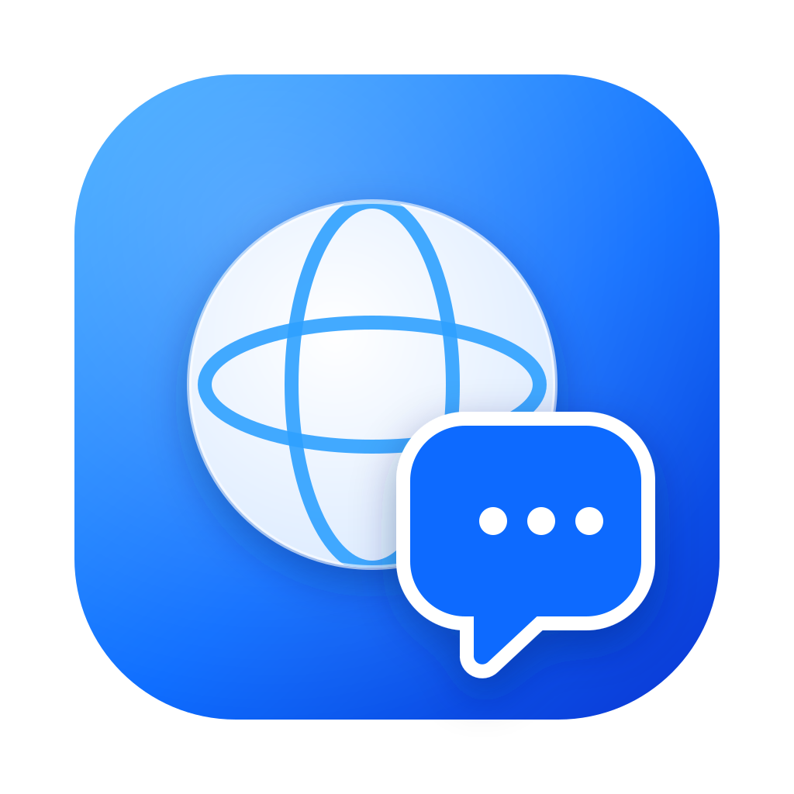
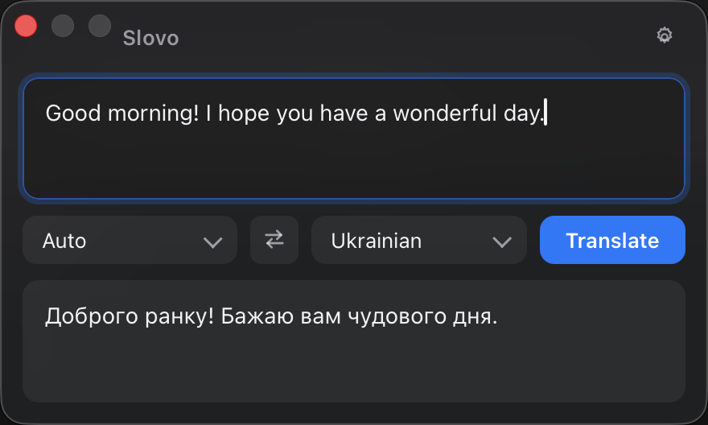
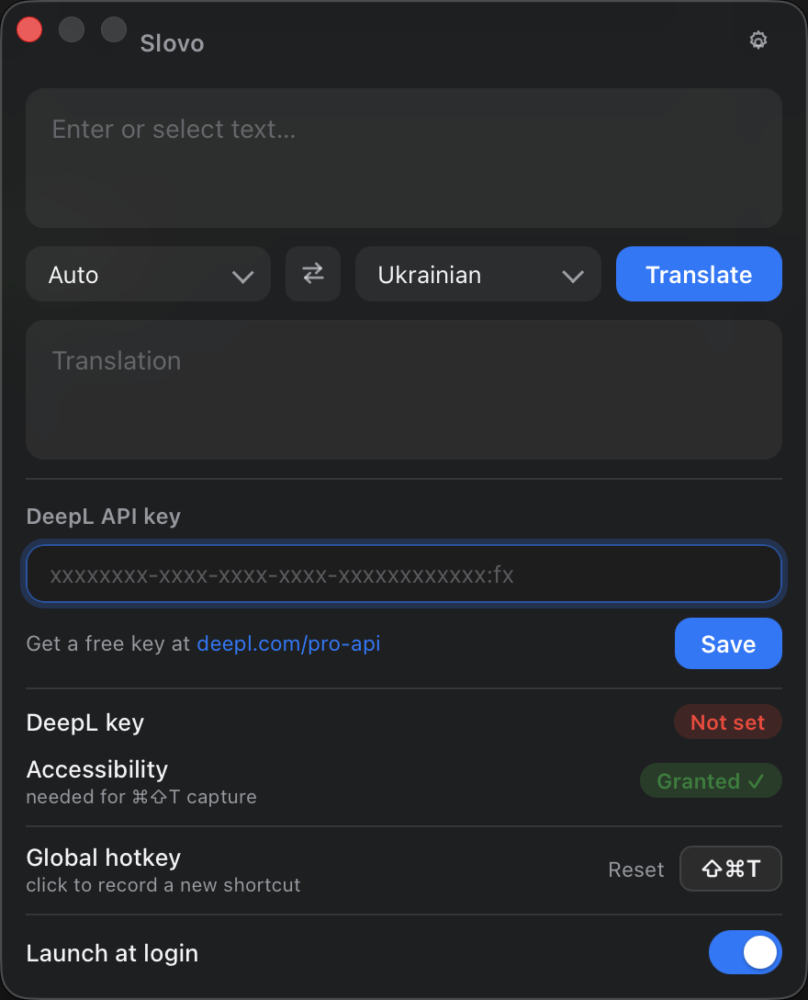

<div align="center">



# Slovo

**A minimalist, Apple-style popup translator for macOS.**
Press a hotkey anywhere, get an instant translation.

[](https://www.apple.com/macos/)
[](https://tauri.app)
[](https://www.rust-lang.org)
[](LICENSE)

</div>

---

Slovo (Ukrainian for *"word"*) is a tiny, native-feeling translator that gets out of your way.
Select text in **any** app, press a global hotkey, and a translucent popup appears with the
translation already done — powered by the [DeepL API](https://www.deepl.com/pro-api). No browser
tabs, no copy-paste dance, no clutter. It lives quietly in your menubar and weighs almost nothing.

Built in **Rust + Tauri v2** with a plain HTML/CSS/JS frontend — no framework, no build step, no npm.

## Screenshots

<div align="center">


&nbsp;&nbsp;


<sub><em>Instant translation popup (left) · settings with status, hotkey recorder & launch-at-login (right)</em></sub>

</div>

## Features

- ⚡ **Global hotkey** (default <kbd>⌘</kbd><kbd>⇧</kbd><kbd>T</kbd>, fully **configurable** in-app) grabs the current text selection from *any* app and translates it instantly.
- 🌐 **100+ languages** with automatic source-language detection, pulled live from DeepL.
- ✍️ **Auto-translate as you type** — debounced, no button to press.
- 🪟 **Native macOS chrome** — real traffic-light title bar, translucent vibrancy/blur, light & dark mode, and a window that hugs its content.
- 📍 **Lives in the menubar.** Closing the window hides it from the Dock; the hotkey or the menubar icon brings it right back.
- 🚀 **Optional launch-at-login.**
- 🔒 **Private by design.** Your DeepL key is stored locally (`~/Library/Application Support/slovo/config.json`); nothing but your text and that key ever reaches DeepL.

## How it works

When you press the hotkey, Slovo:

1. Simulates a <kbd>⌘</kbd><kbd>C</kbd> in the foreground app to copy your current selection.
2. Reads the resulting text from the clipboard (then restores your previous clipboard contents).
3. Sends the text to DeepL, which auto-detects the source language and translates it.
4. Reveals the translucent popup with the result.

If nothing is selected, the popup simply opens empty and ready for you to type.

> **Accessibility permission.** Because step 1 synthesizes a keystroke into another
> application, macOS requires Slovo to be granted **Accessibility** access
> (*System Settings → Privacy & Security → Accessibility*). The in-app Settings panel
> shows the current permission status and a one-click **Grant** button. Without it, the
> hotkey will open the popup but can't capture your selection.

## Install

### Option 1 — Download the release (recommended)

1. Grab the latest `Slovo_x.y.z_aarch64.dmg` from the [**Releases**](https://github.com/Miozzik/slovo/releases) page.
2. Open the `.dmg` and drag **Slovo** into your **Applications** folder.
3. On first launch, **right-click the app → Open**, then confirm.

> ⚠️ **Why right-click → Open?** The app is *ad-hoc signed but not notarized*, so
> Gatekeeper blocks a normal double-click the first time. Right-click → Open is the
> standard one-time bypass; afterwards it launches normally.

### Option 2 — Build from source

See [Build from source](#build-from-source) below.

## Build from source

### Prerequisites

- **macOS** on **Apple Silicon** (the default target is `aarch64`).
  *Intel Macs:* add the target with `rustup target add x86_64-apple-darwin` and build with `--target x86_64-apple-darwin`.
- **Rust** via [rustup](https://rustup.rs).
- **Xcode Command Line Tools**: `xcode-select --install`.
- **Tauri CLI**: `cargo install tauri-cli --version "^2"`.

> **No Node.js required.** The frontend is static HTML/CSS/JS served directly by Tauri.

### Steps

```bash
git clone https://github.com/Miozzik/slovo.git
cd slovo/src-tauri
cargo tauri build
```

Outputs:

- App bundle: `src-tauri/target/release/bundle/macos/Slovo.app`
- Installer: `src-tauri/target/release/bundle/dmg/Slovo_0.1.0_aarch64.dmg`

For development:

```bash
cargo tauri dev
```

> **Note:** Some behavior (menubar/status-bar icon and Dock hide/show) only works
> correctly when running the built `.app`. Use `cargo tauri build` and launch the
> bundle for the full experience.

> ⚠️ **Do not run `cargo update`.** The committed `Cargo.lock` deliberately pins the
> `time` crate to **`0.3.47`**. Version `0.3.48` fails to compile on current `rustc`
> with an `E0119` trait-conflict error. The lockfile is checked in on purpose — leave
> it as-is and the build stays green.

## Usage

1. **Get a DeepL API key.** Sign up for a free key at [deepl.com/pro-api](https://www.deepl.com/pro-api) (free-tier keys end in `:fx` and are fully supported).
2. **Open Settings** (the gear icon) and paste your key.
3. **Grant Accessibility** — Settings shows the current status and a **Grant** button. This lets the hotkey capture your selection.
4. **Set your hotkey** to whatever you like (default <kbd>⌘</kbd><kbd>⇧</kbd><kbd>T</kbd>).
5. **Toggle launch-at-login** if you want Slovo ready the moment you log in.

Now select text anywhere, press your hotkey, and watch it translate. Or just open the popup and type — it translates as you go.

## Configuration

- **Config file:** `~/Library/Application Support/slovo/config.json`
  Stores your API key and chosen hotkey accelerator. Created automatically when you save settings.
- **Environment fallback:** if no key is saved in the config file, Slovo falls back to the
  `DEEPL_API_KEY` environment variable.

The endpoint is chosen automatically from your key: keys ending in `:fx` use DeepL's
free API host, everything else uses the Pro host.

## Project structure

```
slovo/
├── src/                  # Static frontend — no framework, no build step
│   ├── index.html
│   ├── style.css
│   ├── main.js
│   └── assets/           # SVG icons
├── src-tauri/            # Rust backend (Tauri v2)
│   ├── src/
│   │   ├── lib.rs        # App setup, tray, window reveal/hide, commands
│   │   ├── main.rs
│   │   ├── hotkey.rs     # Global shortcut registration & handling
│   │   ├── capture.rs    # ⌘C-and-read-clipboard selection capture (macOS)
│   │   ├── translate.rs  # DeepL translate + language fetching
│   │   └── config.rs     # Local config persistence
│   ├── Cargo.toml
│   ├── Cargo.lock        # Committed — pins the `time` crate (do not delete)
│   └── tauri.conf.json
└── scripts/
    └── test_slovo.sh     # Functional test harness (DeepL + bundle + unit tests)
```

## Contributing

Contributions are welcome! Please read [CONTRIBUTING.md](CONTRIBUTING.md) to get set up and
learn the project's few quirks (the static frontend, the `Cargo.lock` pin, and the test script).

## License

[MIT](LICENSE) © 2026 Yehor Merzlov.

## Credits & acknowledgements

- [**Tauri**](https://tauri.app) — the lightweight Rust app framework that makes the native window, tray, and global shortcut possible.
- [**DeepL**](https://www.deepl.com) — for the translation API and its excellent language coverage.
